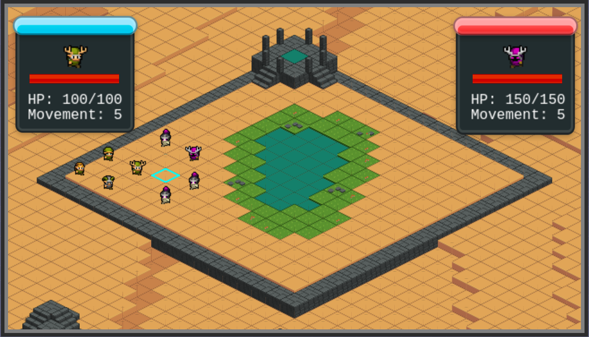

# Tiny Tactics

Welcome, and thank you for downloading our source code for Tiny Tactics!

If you wanted to play the actual game without downloading the source code, the game can be found [here](https://tiny-tactics.herokuapp.com/).

This app is deployed using heroku, which as of November 2022, will no longer support Tiny Tactics.

## About

Tiny Tactics is a tiny tactical RPG featuring two teams of characters. The blue team, your team, is controlled by the player, and can move around and attack enemies within their range. The red team, the enemy, is AI controlled and has the same functionality as the player's team.

Take turns moving and attacking your opponents, and defeat them all to win!

## Dependencies

Install dependencies with: 
```
npm install
```

This app uses Express for running its server, and that's about it.

## Tech Stack

The majority of our source code is made with JavaScript using the Phaser 3 Framework. The webpage and game page are displayed using jQuery, HTML, and CSS.

## Screenshots

Here are some Screenshots from the Game!




Thank you so much for looking over our project, we hope you enjoy the game!